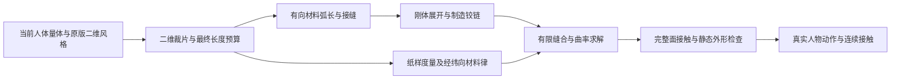

# 纸样到服装：已实现的数学内核与生产边界

状态：数学内核与诊断接入；当前低腰服装 **HOLD**。原版 A 独立保留。出处与曲率相容推导见 [研究规范](SHORTS_PAPER_SURFACE_MATH_20261003.md)。

## 固定表达



二维裁片拥有唯一参考长度。曲率改变方向，接缝改变连接关系，材料应变改变长度。不能把拟合人体得到的三维面反写为二维参考态。下裆预算、接缝长度、目标路径与材料主应变任一矛盾，都产生 witness 并停止升级。

## 生产源码接口

`ShortsPaperSurfaceModel.mjs` 无 Three.js、人体或 GPU 依赖，仅接受当前数据和声明参数：

| 函数 | 关系与输出 | 已实现边界 |
| --- | --- | --- |
| paperTriangle | Dm、逆矩阵、源面积、经纬梯度系数 | 拒绝源退化；材料坐标以米计 |
| evaluatePaperTriangle | F、C=FᵀF、主伸长、经纬/剪切残差与解析梯度 | 当前位置不改变参考度量 |
| xpbdScalarStep | Δλ=(-C-α/dt²·λ)/(Σw∣∇C∣²+α/dt²) | 同一缝合 DOF 先合并梯度；拒绝派生非有限系数 |
| auditSeamArc | 源弧长、方向、缺口分段、允许长度区间 | 两边离散点数可不同；长度通过不认证空间接缝 |
| compilePaperSurfaceModel | 面积质量、source 边界、裁片所属、接缝逐段与铰链分类 | 内片 flat rest 与跨缝未知 law 分开；不认证 sewn topology |
| allocateDiamondRise / auditRiseBudget | R=bodyTape+ease=remainingMainRise+GHeight | G 切边=hypot(GHeight,width/2)；裤脚不得隐式移动 |
| auditSourcePathBound | d≤(1+strainLimit)L 的必要界 | 超界可拒绝当前目标；未超界不能证明可穿 |
| rotateAboutMaterialHinge | proper Rodrigues 刚体折叠 | 度量不变；制造角不是参考角；图循环闭合另需实现 |
| evaluatePaperSurface | 全部当前真实三角的源主应变 | 对失败 witness 保留 piece/source index |
| garmentPipelineGate | paper→metric→sewing→material→contact→shape→motion | 未提供独立通过证据的阶段一律 HOLD |

膜能采用明确的工程简化：

```text
Eww = (Fw·Fw - 1)/2
Evv = (Fv·Fv - 1)/2
Gwv = Fw·Fv
Utriangle = A0/2 * (Kw Eww² + Kv Evv² + Ks Gwv²)
alphaRow = 1/(A0 Krow)
```

Kw/Kv/Ks 为 N/m，U 为 J，残差无量纲，alpha 为 1/J。它使用源面积积分，可在均匀应变细分时保持能量；这不等于有限网格动态解严格不随分辨率改变。没有 Poisson 耦合、实测经纬曲线或弯曲参数校准，不能冒称亚麻完整材料矩阵。纤维纹理只负责外观，不能自动提供力学常数。[XPBD 原论文](https://matthias-research.github.io/pages/publications/XPBD.pdf)

`ShortsClothRuntime.mjs` 使用同一解析内核审计实际主应变。显式 `membraneModel:'orthotropic-paper'`、`paperMaterial:{warpNPerM,weftNPerM,shearNPerM}`、`grainAnglesByPiece` 可使用真实 CPU 经/纬/剪切 XPBD；每个子步重置 lambda，同一子步的迭代保留 lambda。默认仍为旧 distance 方法，未把未经校准的新参数暗中应用到当前人物。旧边长法已经约束三角形剪切，不能称为完全没有剪切；新通道解决的是方向材料律和面积能量权威。

旧跨缝弯曲与 contact/CCD 尚未升级认证。当前工作台强制 `simulationCertified=false`，新的诊断明确显示源度量失败，不让腰头间距通过覆盖材料失败。

## 已执行验证

独立 `tools/probe-shorts-paper-surface-model.mjs`：20/20 有限数学检查通过。包括解析梯度有限差分（最大误差约 3.02e-9）、刚体不变、圆柱弦误差随细分下降、球面映射的真实应变、源面积能量守恒、弧长/缺口冲突、质量/所属裁片/有限数值防护、合法铰链旋转、下裆预算与路径必要界。它只读取现有失败数据，不重建人体、不启动浏览器、不扫描参数。

旧 v4 数据重放最大主应变 45.31455%；实际 v8 7273 点/13568 三角重放 357.30096672%，与原 browser audit 差约 2.9e-14；均 HOLD。证明新函数能识别原失败，不证明不存在其他可行构造。

`tools/probe-shorts-paper-runtime.mjs`：实际生产 Runtime 单个合成三角的 12 次膜更新，将 20% 主应变降低至约 0.04116%，UV/rest/质量不变，质心保持，累计 lambda 与材料参数复制检查通过。测试刚度为合成夹具，没有人物或 GPU；没有把这个小测试当作可穿服装验收。

`tools/qa-shorts-paper-pipeline.cjs`：实际无鼠标 headless A→B→A 检查通过。当前 7273/13568 可交互三维网格确实显示最大主应变 357.30% 与 `HOLD / surface-metric`，动作 disabled、time/steps=0，浏览器错误为零；原版字节 SHA 保持不变。此检查仅认证真实诊断接入，服装 gate 仍失败。数学最终内核 SHA256：eb14c7b325707a4d6e2acb1b3e7ed5b8a6cd49e6357415ecd1fe3eef5c8e4a9a。

## 下一裁剪版本的确定输入

量体 authority 改为当前实际皮肤/原生腿与估计裸胯的独立 tape；保留 pose/source/frame witness。固定原版二维风格分配、用户指定腰口和裤脚标高，先闭合最终 main-rise+G 中线预算与四切边弧长，再生成新纸样。合法铰链初态还要处理 non-tree cycle closure，有限 soft-sew 完成后才可合并 DOF。完整面接触、全 self/CCD 与真实布料标定必须各自完成后才能解锁动作。

不能因当前目标场失败就断言任何纸样/任何布局不可行；不能增加应变阈值、重烘参考态或扩大碰撞推开量来绕过失败。当前原版 A 仍可测试，新版 B 是显示明确失败原因的诊断工作台。

## 仓库七项交付清单

以下未勾选项对应完整服装交付；数学单测或本地诊断不等于公开合格成品。

- [ ] 没有用生成图片代替真实三维实现；
- [ ] 已实际修改生产源码；
- [ ] 用户看到的是可交互三维工作台；
- [ ] 人物/动物几何、骨骼和动作来自真实运行时；
- [ ] 镜头、选择、动作或参数控制可以实际操作；
- [ ] 公网固定链接和真实浏览器已验证；
- [ ] 如果只有截图而没有工作台，本轮判定失败。
