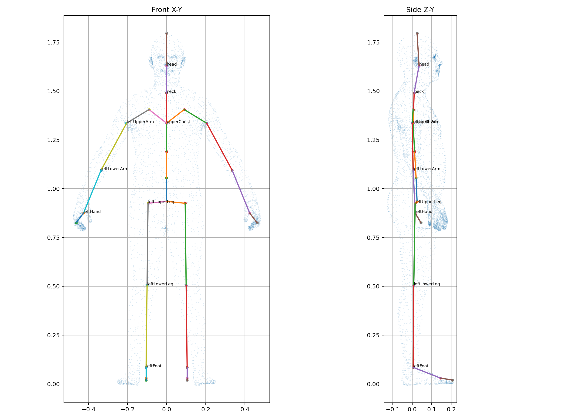

# V8.3 骨架与示例人体表面拟合报告

本报告记录 `smpl-male-surface-fit-1796-v2` 骨架与当前 GLB 示例人体表面的数据拟合结果。



左图为正面 X/Y 投影，右图为侧面 Z/Y 投影。浅蓝色点来自示例人体网格顶点，彩色线段为当前骨链。

## 主要拟合点

```text
骨盆中心    [ 0.000, 0.925,  0.016 ]
上胸        [ 0.000, 1.335,  0.002 ]
颈根        [ 0.000, 1.490, -0.010 ]
头部中心    [ 0.000, 1.630,  0.055 ]

左锁骨      [-0.100, 1.405, -0.005 ]
左肩        [-0.210, 1.340, -0.020 ]
左肘        [-0.350, 1.105,  0.025 ]
左腕        [-0.435, 0.900,  0.120 ]
左手节点    [-0.463, 0.840,  0.145 ]

左髋        [-0.100, 0.925,  0.016 ]
左膝        [-0.110, 0.500,  0.002 ]
左踝        [-0.160, 0.100, -0.002 ]
左前脚掌    [-0.176, 0.035,  0.120 ]
左脚趾末端  [-0.176, 0.020,  0.195 ]
```

右侧使用镜像坐标。

## 当前结论

1. 肩关节中心已经移动到上臂根部内部。
2. 腕关节增加前向 Z 偏移，使骨链进入手腕与手掌中心。
3. 膝关节高度调整到约 0.500 m。
4. 踝关节横向位置向足部中心移动。
5. 前脚掌和脚趾骨链沿足部前向延伸。
6. 大腿长度略长于小腿，符合当前网格的关节中心距离。

该拟合属于当前示例人体的几何适配。更换不同体型或不同拓扑的人体表面时，应重新生成 BodyProfile 和关节拟合数据。

## 变形质量保护

当前运行时权重经过三层处理：

```text
人体区域候选骨链隔离
A 姿势手部与下肢候选边界保护
真实三角形邻接权重平滑 3 轮
```

随后使用每顶点最多四个影响的 CPU 双四元数变形。自动 T 姿势检查得到：

```text
最大顶点位移 0.6531 m
全身最大三角边伸长 5.632 倍
肩部最大三角边伸长 1.645 倍
```

全身最大值位于极短的手部三角边，肩部使用独立质量门槛。上述指标用于阻止后续修改重新引入明显的肩部尖刺和大面积拉扯。真实 WebGPU 画面仍需在 Windows 浏览器中检查轮廓、法线和交互感受。

