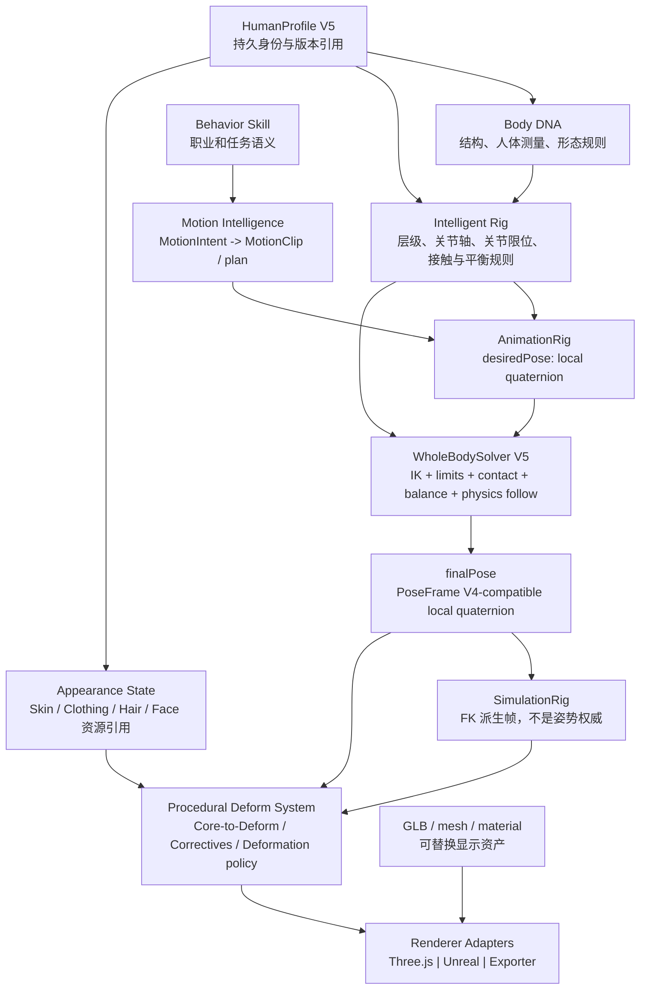

# Human Core Engine V5 架构审查

> 审查类型：只读代码审查；本分支只新增本文档，不包含功能代码、资产或运行时行为修改。
> 代码事实来源：GitHub `main`，commit `29625f7780009fdb08d0d7e02d0ceca6943400e5`，tree `8d888079a99dcd9ac434021e54e69cd0657ab514`。
> 审查日期：2026-08-24。

## 结论

项目应当从“以单个 GLB 人物为中心的传统角色工具”**渐进升级**为 Human Core Engine，而不应推倒当前的 V4 链路。

这里的 Human Core 不是另建一套角色状态，也不是让 AI 直接控制网格。它是一个与渲染器、具体人体资产和职业行为解耦的、可验证的人体结构与运动真相层：

```text
人体结构和约束是权威
局部四元数姿势是运行时权威
网格 / GLB / Three.js 是可替换的显示与资产适配层
```

当前 V4 已经具备这条迁移路线的关键起点：`PoseFrame V4`、`SimulationRigFrame V4`、MotionClip V4 以及 Production Skin V4 的正式输入都以 `localRotations` 为中心。它尚不具备“Human Core 已完成”的条件：`main` 中没有 V4 WholeBodySolver；PhysicsRig 的位置 PBD 仍是可运行的旧路径；当前 GLB 仍是 24 关节兼容资产，明确标记为 `productionReady: false`。

因此推荐目标是：**Human Core Engine V5，采用“规范核心 + 兼容适配器 + 逐步替换”路线。**

## 1. 当前系统评价：源码确认的事实

| 层 | GitHub `main` 中已确认的实现 | V5 审查结论 |
| --- | --- | --- |
| Pose Authority | `src/modules/pose/pose-frame-v4.js` 定义 `humanoid_rig/pose_frame@4.0`；根旋转与局部关节四元数分离，禁止 bone length、bind、inverse bind 与父子层级进入姿势帧。 | 可以保留为 V5 的姿势事实基础。 |
| Animation | `AnimationRigRuntime` 只采样、分层混合并输出 `desiredPose`，明确不写 Skin 或 `simulationRig`。MotionClip V4 只允许根位置/旋转和非根局部四元数轨道。 | 方向正确；应成为 Motion Intelligence 的动作资产与采样子层，而不是最终人体状态。 |
| Simulation Rig | `buildSimulationRigFrameV4()` 以 `finalPose.localRotations` 正向运动学生成世界变换，并声明 `authority: local-quaternion-v4`。 | 可保留为渲染、拾取、附件和旧工具的派生帧，不应成为第二套姿势权威。 |
| PhysicsRig | `legacy/v8/src/physics-rig.js` 已能接受/返回 PoseFrame V4；同时仍维护 world-position PBD、骨长约束、拖拽与固定点。世界坐标写入会清除旋转权威状态。 | 仍是双体系过渡层，不能继续被扩展为最终的真人级运动权威。 |
| Skin | Production Skin V4 从 `simulationRig.finalPose.localRotations` 获取旋转，正式路径不通过世界坐标重建旋转；Three.js GPU LBS 加骨驱动 corrective 已存在。 | 应拆分为“与渲染无关的 Deform 策略”与“Three.js Skin Adapter”。当前实现本身仍是兼容资产适配器。 |
| 资产 | `SKIN_BINDING_METADATA.json` 表明源 GLB 为 24 joints、过渡权重、`productionReady: false`；V4 profile 也标记 `assetClass: compatibility`。 | GLB 不能是人体核心真相。必须在生产资产到位前保持兼容标记和视觉验收门。 |
| Renderer | `legacy/v8/src/three-view.js` 保存并转交 `simulationRigFrame`，在 WebGPU / WebGL 回退下显示骨架、Skin、服装及附件。 | 这是 Renderer Adapter，而不是人体逻辑层。 |
| Whole-body Solver | 当前 `main` 的完整递归树中没有 `whole-body`、`motion-solver` 或 `human-motion` 路径。 | 不能把 WholeBodySolver V4 写成已完成；它是 V5 必须补上的迁移阶段。 |

### 1.1 当前权威数据链的正确表述

当前源码不等同于“Motion → Pose → Animation → Physics → Skin”的串行所有权。更准确的关系是：

```text
MotionClip V4 / 用户静态姿势 / 图片重定向
                 ↓
        AnimationRig 或 Pose 输入
                 ↓
     desiredPose (PoseFrame V4, local quaternion)
                 ↓
       约束 / IK / 接触 / Physics Follow
                 ↓
     finalPose (PoseFrame V4, local quaternion)
                 ↓
 SimulationRigFrame (FK 派生的世界变换)
                 ↓
 ProductionSkinRuntime / Clothing / Appearance / Renderer
```

`desiredPose` 与 `finalPose` 是不同阶段的姿势；`SimulationRigFrame.fk` 是派生数据。新功能不得反向以 FK 世界坐标覆盖 `finalPose`。

### 1.2 V4 当前不能宣称完成的部分

1. `PhysicsRig` 的直接编辑与 PBD 路径仍以位置为主要工作表示；从世界位置反推出旋转会丢失轴向 twist，源码也保留了该兼容风险提示。
2. Motion Foundation V4 的七个资产是 schema、接触、相位与重定向的 contract fixtures；文档将旧程序化动作冻结为 legacy test-only。它们不是已验收的真人动作库。
3. Production Skin V4 的正式输入已经正确，但当前兼容 GLB 没有 DCC 创作的 clavicle、scapula、twist、finger 权重，也没有创作型 PSD。自动测试不能替代肩、肘、前臂、髋、膝和行走的视觉验收。
4. 当前 V4 决策将 GPU LBS + bone-driven correctives 作为兼容资产默认；CPU DQS / offline Hybrid 仅是质量参考实验，不是正式 GPU Hybrid 变形器。

## 2. Human Core Engine V5 目标架构

V5 将“人体是什么、人体能如何运动”与“如何把人体画成一个 GLB”分开。核心只保存和处理稳定、可验证、可跨渲染器的数据；所有网格和图形 API 都经由适配器接入。



### 2.1 Human Core 的六个职责

| 子系统 | 职责 | 不负责 |
| --- | --- | --- |
| **Body DNA** | 人体拓扑家族、不可变结构引用、人体测量、比例规则与体态约束。 | 网格顶点、GPU buffer、动画轨道。 |
| **Intelligent Rig** | 稳定关节 ID、层级、bind reference、已有 `twistAxisLocal` / `bendAxisLocal` / `sideAxisLocal`、限位、接触和稳定性规则。 | 直接写 Three.js Bone 或 Skin 权重。 |
| **Motion Intelligence** | 将意图、环境、当前状态和可用动作资产转换为可执行的 motion plan / desiredPose。 | 直接改变骨长、绑定或网格。 |
| **Procedural Deform System** | Core → Deform 映射、corrective 评估、区域变形策略与资产兼容门。 | 选择某一渲染器或伪造缺失的 DCC 权重。 |
| **Behavior Layer** | 职业、任务、交互和高层决策；输出 `MotionIntent`，可选择技能。 | 生成未经验证的关节四元数或直接操控 Skin。 |
| **Renderer Adapter** | 将 `finalPose`、派生 FK、Appearance 资源与变形结果提交给 Three.js、Unreal 或导出器。 | 保存人体权威状态或改写核心约束。 |

## 3. GLB 的正式定位

在候选项中，V5 **选择 B：GLB 是显示缓存 / 运行时资产（Renderer Adapter 输入）**。

选择 B 的理由：GLB 能正确承载网格、材质、纹理、`JOINTS_0`、`WEIGHTS_0` 和 inverse bind matrices，却无法单独表示可验证的人体规则、意图、行为、版本化约束或跨资产的运动逻辑。把它作为最终人体核心，会重新产生“资产骨架、PhysicsRig、动画轨道各自为真”的分裂。

GLB 可以有两个次级、非权威角色：

- **C，训练数据参考**：仅限许可、来源和隐私均经过审查的离线流程；训练样本不能反向成为运行时人体真相。
- **D，资产导出格式**：Human Core 的一个可选导出目标；导出不应定义 Core schema。

GLB 不是 A。当前的 `smpl-male-surface-skinned.glb` 更明确是 compatibility asset；其不足必须由生产资产管线解决，而不是由运行时重建权重掩盖。

## 4. V5 规范数据模型

### 4.1 持久数据与瞬态数据必须分开

`ProjectState`、Revision、OperationEvent 和 Character Core 继续管理低频、可保存的正式变化。60 FPS 的人体帧、FK 世界坐标、渲染 buffer 和 solver 中间量不进入 ProjectState，也不作为多窗口普通 JSON 的高频载荷。

```text
持久：HumanProfile V5、BodyDNA 版本、RigDefinition 版本、Appearance 引用、BehaviorSkill 选择、资源引用
瞬态：MotionIntent、desiredPose、finalPose、contacts、IK targets、Solver diagnostics、SimulationRig FK
```

建议 V5 采用以下逻辑模型；这是迁移目标，不表示本审查已创建任何 schema 或代码。

```ts
interface HumanProfileV5 {
  schema: 'humanoid_rig/human_profile@5.0';
  humanId: string;
  version: number;
  characterProfileRef?: { characterId: string; revision: number }; // 兼容现有 Character Core
  bodyDNARef: { id: string; revision: number };
  rigDefinitionRef: { id: string; version: string };
  appearanceStateRef: { id: string; revision: number };
  behaviorLoadout: Array<{ skillId: string; revision: number }>;
  resourceRefs: Array<{ uri: string; kind: string; hash?: string }>;
  revisions: {
    proportion: number; pose: number; animation: number; skin: number;
    clothing: number; appearance: number;
  };
}

interface BodyDNA {
  schema: 'humanoid_rig/body_dna@5.0';
  id: string;
  topologyFamily: string;                 // 例如 humanoid-core-v5
  anthropometry: Record<string, number>;  // 身高、段长、肩宽、髋宽等规范化量
  morphology: Record<string, number>;     // 肌肉、脂肪与体积表达的无网格参数
  asymmetryPolicy: 'symmetric' | 'authored';
  constraintProfileRef: string;
  proportionRevision: number;
}

interface RigState {
  schema: 'humanoid_rig/rig_state@5.0';
  rigVersion: string;
  pose: PoseFrameV4;                      // root + local quaternion，归一化
  contacts: MotionContactData[];
  ikTargets: IKTarget[];
  constraintState: Record<string, unknown>;
  solverStatus: 'desired' | 'solved' | 'degraded';
}

interface MotionIntent {
  schema: 'humanoid_rig/motion_intent@5.0';
  intentId: string;
  action: 'idle' | 'locomote' | 'turn' | 'sit' | 'stand' | 'reach' | string;
  target?: { position?: [number, number, number]; direction?: [number, number, number] };
  environmentRefs: string[];
  priority: number;
  constraints: { speed?: number; handsFree?: boolean; contactsRequired?: string[] };
}

interface BehaviorSkill {
  schema: 'humanoid_rig/behavior_skill@5.0';
  skillId: string;
  name: string;
  preconditions: string[];
  intentTemplate: Record<string, unknown>;
  requiredCapabilities: string[];
  version: number;
}

interface AppearanceState {
  schema: 'humanoid_rig/appearance_state@5.0';
  skinBindingRef: { id: string; revision: number; assetClass: 'compatibility' | 'production' };
  faceRef?: { id: string; revision: number };
  clothingRefs: Array<{ clothingId: string; revision: number }>;
  hairRef?: { id: string; revision: number };
  accessoryRefs: Array<{ id: string; revision: number }>;
}
```

为避免 `RigState` 被误持久化为每帧状态，V5 还应定义不写入 ProjectState 的 `HumanRuntimeFrame`：

```text
desiredPose + finalPose + contacts + IK + Solver diagnostics + SimulationRig FK
```

它的唯一 rotation authority 仍是 `finalPose.localRotations`；FK 世界位置只用于显示、交互、附件和遗留兼容工具。

## 5. 当前模块的去向

| 当前模块 | V5 决策 | 具体迁移边界 |
| --- | --- | --- |
| Proportion | **保留并重构为 Body DNA Compiler** | 现有比例参数继续有效，但输出从“直接服务某个视口骨架”收敛为 BodyDNA / RigDefinition 版本。不得让 BodyShape 改骨长。 |
| Rig | **保留并重构为 Intelligent Rig** | 稳定 ID、层级、bind 参考、关节局部轴、限位与接触语义继续是唯一结构真相。Core Rig 与可选 Deform Rig 保持分层。 |
| Skin | **保留，但拆分职责** | `ProductionSkinRuntime`、binding profile 与 corrective 规则演化为 Procedural Deform System；`smpl-skin.js` 与 Three.js `SkinnedMesh` 保持 Renderer Adapter。当前 24-joint 资产只能兼容，不可标记生产完成。 |
| Pose | **保留为规范状态** | PoseFrame V4 是 V5 `RigState.pose` 的兼容基础。静态 A/T/Reach/Step 是 Pose 输入，而不是 Animation 资产的替代品。新的功能不得把 world position 提升为权威。 |
| Animation | **保留并重构为 Motion Intelligence 的执行层** | MotionClip V4、phase、contacts、retarget 和 `AnimationRigRuntime` 继续使用；它们只产生 `desiredPose`。旧正弦/程序化预设冻结为 legacy tests。 |
| PhysicsRig | **保留为过渡与交互工具，停止作为最终权威扩展** | 直接拖拽、位置 PBD 和旧 V8 兼容可保留；V5 新建/迁移 rotation-aware WholeBodySolver 时，必须以 PoseFrame V4 输入输出，并显式处理接触、平衡与物理跟随。 |
| Character Core / ProjectState | **保留** | Character Core 可作为 `HumanProfileV5` 的兼容入口；ProjectState 继续是正式持久状态唯一来源，但不承载逐帧动画。 |
| Three.js / V8 View | **降为 Renderer Adapter** | 继续消费 SimulationRig 的派生帧和 Appearance；禁止反向改写 RigState、MotionIntent 或人体结构。 |

### 5.1 必须冻结的旧路径

以下路径可保留为兼容或诊断，但不得作为新 V5 功能的输入或权威来源：

1. 从 `poseWorldPosition` / bone direction 重建正式旋转的路径；`calculateJointDeltaRotation()` 已被标记为 legacy compatibility only。
2. 运行时生成正式 `JOINTS_0`、`WEIGHTS_0` 或 inverse bind matrices；Production Skin V4 已要求 production path 使用 asset-prebound 数据。
3. 继续扩展固定公式的程序化动作；Motion Foundation 文档已经把它们冻结为 legacy test-only。
4. 将 SimulationRig FK、Renderer 对象或 GPU 资源写回 Character / ProjectState 的行为。

## 6. 四阶段迁移路线

### Phase 1 — Core Contract Consolidation（先做）

目标：不动网格、不重制动作、不更换渲染器，先让数据真相唯一。

1. 以 V5 schema 的设计稿落地 `HumanProfileV5`、`BodyDNA`、`MotionIntent`、`BehaviorSkill`、`AppearanceState` 与非持久 `HumanRuntimeFrame`。
2. 建立 CharacterProfile → HumanProfileV5 的只读兼容映射；保留现有 revision，而不创建第二套 ProjectState。
3. 明确 `RigDefinition` 是所有关节轴、层级和 bind 数据的唯一来源；`PoseFrame V4` 是旋转状态唯一来源。
4. 为每种 Renderer Adapter 定义只读输入：`finalPose`、FK、AppearanceState、binding profile。

通过门：schema 验证、revision 兼容、无 bind/topology 泄漏到 Pose、现有 Character Studio 仍只创建一个 ProjectHubClient。

### Phase 2 — Intelligent Rig and WholeBodySolver V5

目标：收敛目前的“局部四元数 + 位置 PBD”双体系，而非把旧 PBD 包装后命名为新求解器。

1. 定义一个 V4-compatible `WholeBodySolver` 输入输出：`desiredPose` → `finalPose`，其余为 contacts、IK targets、joint limits、balance 和 physics-follow 参数。
2. 将 PhysicsRig 的世界位置 PBD 限制为接触/交互的辅助约束；它不能重写局部旋转权威。
3. 实现局部四元数的 joint-axis、关节限位、IK、根朝向和左右镜像测试，再接入平衡与接触求解。
4. 只在 T/A、arm raise、forearm twist、squat、lunge、walk 等视觉门通过后，才逐步切换 runtime 默认求解器。

通过门：不存在骨长、父子层级、inverse bind 修改；四元数往返误差小于 0.1 度；固定脚、根运动方向与左右步态连续。

### Phase 3 — Production Deform and Renderer Adapters

目标：让人体核心不依赖一个具体 GLB，同时不掩盖资产不足。

1. 将 Core-to-Deform、correctives 和 deformation quality policy 抽出为不依赖 Three.js 的逻辑层。
2. 保留 `ProductionSkinRuntime` 作为 Three.js adapter，读取 `finalPose`；Unreal / exporter 只需实现同一只读输入协议。
3. 获取并验证带 authored clavicle、scapula、twist、finger weights、UV、tangent 与 PSD 的许可明确生产资产。
4. 仅在该资产及 visual acceptance 完整通过后，再实施 GPU Hybrid deformation；不能将当前 CPU 实验的指标视为交付性能。

通过门：Production Skin metadata 不再是 compatibility / `productionReady: false`；所有人体测试姿势通过人工视觉验收；比例变更需要明确 rebind 或阻断策略。

### Phase 4 — Motion Intelligence and Behavior Layer

目标：从“播放动作片段”升到“人体根据意图选择并执行动作”，但不让行为层直接控制骨骼。

1. 以 MotionIntent 驱动 MotionClip 查询、phase locomotion、retarget 和动画层混合。
2. 建立许可明确的基础运动资产库与质量分析，而非继续通过增加公式关键帧伪造真实动作。
3. BehaviorSkill 仅产出目标、约束、环境引用和优先级；Motion Intelligence 负责选择/规划；WholeBodySolver 负责最终姿势。
4. 在多人物比例、接触、停步、转身、坐站和伸手等基础能力稳定后，才接入职业行为（飞行员、机械师、士兵、指挥员等）。

通过门：60 FPS 目标以真实浏览器 profile 验收；行为不修改 bind、比例或 Skin；多窗口只同步意图和低频状态，不同步每帧顶点/骨架数据。

## 7. 风险与控制措施

| 风险 | 后果 | 控制措施 |
| --- | --- | --- |
| 双姿势权威复发 | world position 与 local quaternion 相互覆盖，产生肩、前臂、脚和手指异常。 | 新接口一律标注 space / authority；world position 只作为 FK 结果或 legacy tool 输入。 |
| 误把兼容 GLB 当生产资产 | Runtime 看似稳定，极端姿势仍塌陷或“橡皮泥化”。 | 保留 metadata gate，生产资产须 DCC authored weights + PSD + 人工视觉验收。 |
| Solver 迁移过大 | 一次替换破坏 V8 编辑、接触与多窗口。 | 以 adapter/shadow mode 对比 desiredPose、finalPose 与 FK；通过每个视觉门后逐步切换。 |
| ProjectState 被帧数据污染 | 多窗口消息变大、revision 失控、刷新恢复不稳定。 | HumanRuntimeFrame 仅走 transient bus；持久化只保存可恢复的引用、版本和低频状态。 |
| 资产许可、人体数据与隐私 | 无法安全分发或训练。 | 所有生产网格、动作、图片/动作捕捉数据进入资源清单、来源和再分发审查。 |
| 自动测试被误认为视觉验收 | 数学契约通过但人体仍不自然。 | 保留并执行 `PRODUCTION_SKIN_V4_VISUAL_ACCEPTANCE.md` 的人工浏览器清单；本审查不替代该验收。 |

## 8. 第一阶段开发任务清单

下列是 V5 的**下一次实现任务**，不属于本次审查的代码变更：

1. 新增 V5 数据 schema，并在 Character Core 中实现一个向后兼容的 CharacterProfile → HumanProfileV5 mapper；不迁移历史人物数据的物理绑定。
2. 定义 `HumanRuntimeFrame` 和 `RendererAdapterInput` 的只读 TypeScript/JavaScript contract，验证它们不进入 ProjectState 的正式 revision 流。
3. 为 RigDefinition 增加可审计的 Core Rig / optional Deform Rig capability summary，复用现有三轴字段，不创建第二套 axis schema。
4. 建立 WholeBodySolver V5 的接口测试桩（无正式切换）：验证 `desiredPose` 和 `finalPose` 均为 PoseFrame V4，且不会改 bind、bone length、parent、inverse bind matrices。
5. 为当前 renderer 实现 shadow diagnostics：同帧记录 source authority、solver status、binding profile、asset class 与 proportion compatibility；不更改视口 UI 主框架。
6. 将“自动契约测试通过”和“浏览器视觉验收通过”拆成两个发布门，特别覆盖肩、前臂 twist、手指、髋、膝、脚和左右步态。

## 9. 预计涉及的文件范围（规划，未修改）

| 范围 | 预计动作 |
| --- | --- |
| `schemas/` | 未来新增 HumanProfile V5、BodyDNA、MotionIntent、BehaviorSkill、AppearanceState 的稳定 schema。 |
| `packages/character-core/` | 增加兼容 mapper 与版本引用，不取代 ProjectState。 |
| `src/modules/proportion/`、`src/modules/pose/`、`src/modules/animation/` | 将现有 V4 contract 适配到 BodyDNA / Intelligent Rig / Motion Intelligence；不复制另一套 Rig。 |
| `legacy/v8/src/physics-rig.js` | 仅在 Phase 2 迁移时隔离旧 position PBD，并接入 rotation-aware solver interface。 |
| `legacy/v8/src/production-skin-runtime.js`、`skin-binding-profile-v4.js`、`smpl-skin.js` | 在 Phase 3 拆分 renderer-neutral deform policy 和 Three.js adapter；不在运行时重建生产权重。 |
| `legacy/v8/src/three-view.js` | 保持为 adapter consumer；仅接入稳定的 renderer 输入。 |
| `tests/`、`legacy/v8/tests/` | 先建立数据权限、solver、renderer adapter、比例门和视觉验收记录的分层测试。 |

## 10. 审计结论与下一步

**最终推荐架构：Human Core Engine V5 = BodyDNA + Intelligent Rig + PoseFrame V4-compatible RigState + Motion Intelligence + rotation-aware WholeBodySolver + Procedural Deform System + Renderer Adapters。**

项目不应将 GLB、Three.js Bone、PhysicsRig 的 world-position buffer 或单个动作文件升级为核心真相。应把现有的 V4 局部四元数契约作为迁移锚点，保留有效模块，冻结不可靠旧路径，并通过 Phase 1 的数据分层和 Phase 2 的求解器收敛逐步完成核心化。

本次审查只验证了 GitHub 当前 `main` 的文件和现有测试源码；没有启动浏览器、没有进行人工视觉验收，也没有把自动测试结果表述为人体视觉质量结论。

