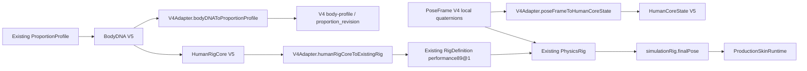

# Human Core V5 · BodyDNA 与 Intelligent Rig 第一阶段设计

## 状态与范围

本文件记录 `feature/human-core-v5-bodydna-intelligent-rig` 的第一阶段数据层。它以当前 `main` 的 V4 本地四元数姿势链为兼容基线，不替换 V4，也不把 GLB、网格、蒙皮权重或 MotionClip 放入人体核心状态。

本阶段只建立三项能力：

1. `BodyDNA V5`：稳定描述“这个人是谁、身体结构是什么”。
2. `HumanRigCore V5`：稳定描述“这个人的运动关节规则是什么”。
3. `HumanCoreRuntime` 与 `V4Adapter`：把上述数据映射到既有 Proportion、Rig、PoseFrame V4 和 Skin 接口。

它不是新的 ProjectState、Character Manager 或渲染器。正式保存、Revision、OperationEvent 与多窗口广播仍由现有 `src/project-hub.js` / Character Core 管理；V5 Runtime 仅维护可序列化的运行时快照，供该正式状态层后续接入。

## 数据模型

### BodyDNA V5

Schema：`humanoid_rig/body_dna@5.0`

`BodyDNA` 是人体身份和结构参数，不是网格、GLB、骨骼绑定或动画资产。

| 字段 | 作用 |
| --- | --- |
| `identity` | `humanId`、显示名、来源和标签；`humanId` 是人体唯一标识。 |
| `proportion` | 身高、肩宽、髋宽、头身比例、上/前臂、手控点、大腿、小腿长度与身体厚度。 |
| `mass` | 体重与躯干、四肢、头部的质量分布。 |
| `bodyType` | 体型分类与置信度。 |
| `asymmetry` | 左右肩、髋、四肢长度的显式微差。 |
| `ageProfile` | 年龄段、成熟度和未来年龄形变接口。 |
| `genderProfile` | 自描述类别、形体表达和未来参数接口；不驱动固定网格。 |
| `fitnessProfile` | 肌肉、脂肪与区域分布接口。 |
| `proportionRevision` | 继续引用现有比例版本，不改写 V4 的 `proportion_revision` 语义。 |

禁止字段由运行时验证：网格、GLB、JOINTS/WEIGHTS、inverse bind matrices、父子绑定、骨长资产、动画轨道及图片/二进制资源。这样 BodyDNA 始终可以跨渲染器和跨资产使用。

### HumanRigCore V5

Schema：`humanoid_rig/human_rig_core@5.0`

`HumanRigCore` 不复制新的骨架体系。它投影当前 `performance89@1` / V4 `RigDefinition`，保留其关节 ID 与父子关系，并将 20 个稳定人体核心关节标为 `coreJointIds`：

```text
hips → spine → chest → upperChest → neck → head
left/right Shoulder → UpperArm → LowerArm → Hand
left/right UpperLeg → LowerLeg → Foot
```

每个关节的 `JointSemanticProfile V5` 包含：

```text
jointId
parentId
mobilityProfile
limitProfile
massInfluence
motionRole
axisReference
affectedJoints
```

`axisReference` 是对现有 Rig 定义中 `twistAxisLocal`、`bendAxisLocal`、`sideAxisLocal` 的引用；没有新建第二套 joint-axis schema。肩部使用球窝语义（屈伸、外展/内收、旋转）并声明与锁骨、肩胛、胸腔关联；膝盖使用铰链语义并禁止反向屈曲。可选 Deform Joint（锁骨、肩胛、扭转骨、手指）只作为现有 Rig 的扩展投影，不能改变 Core Rig ID，也不作为 V4 Pose Authority 的替代。

### HumanCoreState V5

Schema：`humanoid_rig/human_core_state@5.0`

```text
HumanCoreState
├── bodyDNA
├── rigState
├── poseState
├── motionState
├── balanceState
└── appearanceState
```

`poseState.frame` 仅保存 `PoseFrame V4`；它的旋转仍为归一化 local quaternion。`motionState` 只保存 clip 和播放状态引用。`appearanceState` 只保存引用摘要。状态验证拒绝 mesh、GLB、二进制、动画轨道和 inverse bind matrices。

## V4 / V5 兼容路径



适配器规则：

- `BodyDNA → ProportionProfile` 只映射既有 V4 `height`、肩/髋宽和肢体长度，不修改 `proportion_revision`。
- `HumanRigCore → RigDefinition` 调用既有 `applyBodyProfileToDefinition()`，保留父子关系与当前 Rig 的既有关节 ID。
- `PoseFrame V4 → HumanCoreState` 要求 `compatibleRig` 和 `proportionRevision` 匹配，直接保存 local quaternion，不将旋转退化成 world position。
- Production Skin Runtime 继续从 `simulationRig.finalPose.localRotations` 读取；Human Core Runtime 不写入 Skin Runtime。

## Runtime 接口

`HumanCoreRuntime` 提供：

```js
const runtime = new HumanCoreRuntime();
const state = runtime.createHuman(bodyDNA);
runtime.updatePose(poseFrameV4);
runtime.updateMotion({ clipId, phase, playbackState });
const report = runtime.evaluateConstraints();
const rigState = runtime.getRigState();
```

`evaluateConstraints()` 在第一阶段只执行结构、关节轴引用、姿势兼容性与基础重心诊断；它不是第二个 Physics Solver，不能改写既有 V4 PhysicsRig。

## 未来扩展接口

- 将经过 Character Core 审批的 BodyDNA 引用接入 ProjectState、Revision 和 OperationEvent。
- 为 BodyDNA 加入版本化的族群统计、伤病、年龄变化和扫描/生成来源，但仍只保存结构化数据与资源引用。
- 由 Intelligent Rig 利用当前 `jointAxes`、joint limits、质量分布和 balance diagnostics 驱动 Whole Body Solver；该 Solver 必须输出 PoseFrame 兼容的 local quaternion。
- 将 Procedural Deform、服装、头发和渲染后端作为独立适配器消费 `HumanCoreState`，不得写回 Core Rig 或 BodyDNA。
- 将 GLB 保持为 Renderer Adapter 的资产/缓存/导出格式，而不是人体事实来源。

## 第一阶段限制

- 不改变 SMPL、GLB、SkinBindingProfile、Production Skin Runtime、MotionClip 或既有动画资产。
- 不修改 Character Studio 页面、职业行为、AI 行为、图片识别或 Procedural Skin。
- `performance89@1` 仍是当前 V4 Runtime 的实际 Rig；V5 尚未替换其渲染或物理解算路径。
- 这项实现以自动化文件与运行时接口验证为准；浏览器/视口视觉验收仍由主项目后续集成阶段执行。
