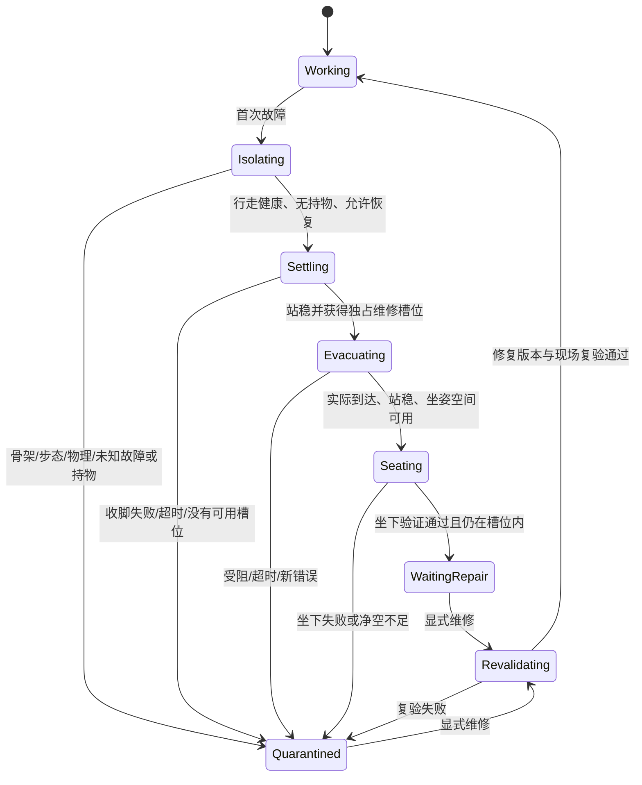

# 固定 NPC 角色包与世界秩序框架 R1

2026-09-13。依据用户提出的目标：基础动作修好后，把每个人封装成固定 NPC，固定职责和持续活动，减少开销；发生无法继续的错误时，能安全行动者前往指定区域坐下等待修复，以统一框架维持大世界秩序。

**当前状态：实施设计，运行代码尚未接入。** 本轮固定需求、数据边界、故障流程和落地顺序。现有肩颈、大角度抬臂、完整坐卧与搬运回程尚未全部通过，不能把当前人物封版为“稳定角色”。先按 `MOTION_FOUNDATION_REPAIR_PLAN_R5.md` 修复基础，再逐角色、逐任务发布。

## 1. 一个固定角色包，一份独立运行存档

角色包定义“这个人是谁、长什么样、能够做什么、每天执行哪些任务”。发布后只读，任何修复或设定变化都产生新版本，不在运行时悄悄改写旧包。位置、疲劳和任务进度等运行状态独立保存，否则人物无法活动，也无法修复后继续生活。

| 数据层 | 内容 | 修改规则 |
| --- | --- | --- |
| `NPCPackage` | 永久角色 ID、姓名职责、体型、皮肤毛发面部参数、随机种子、能力上限、附件、固定任务及转移规则、活动区域引用、故障策略、依赖版本与验收证据 | 发布后不可变；修复产生新版本 |
| `NPCInstance` | 实例 ID、所用包版本、站位朝向、当前姿态和动作、任务游标、疲劳与生理状态、持有物、资源占用、计时器、故障状态 | 仅本实例与世界事务管理器可更新 |
| `NPCJournal` | 任务完成、异常、撤离、维修、版本切换、性能摘要、可恢复的最近检查点 | 追加记录，有上限和归档规则 |
| `NPCResourcePool` | 相同版本、体型与质量的不可变几何缓冲、绑定数据、程序及相同毛发资源 | 共享只读，按引用计数回收 |
| `WorldDirector` | 世界时间、区域和座位、物体归属、交通/作业预约、故障队列、全局预算 | 世界统一持有，不能复制进各人物后各自修改 |

“包里记录一切”表示有完整定义、依赖引用与可追溯的实例存档，不表示每个包都复制一整套公共资源，也不把世界状态写死。沿用项目的生成函数、参数、关系、来源约束；没有保存扫描模型、烘焙网格或逐帧顶点轨迹的需要。

包的逻辑结构拟定为：

```text
packageId + revision + contentHash
├─ compatibility       生成器、身体族、骨架、动作内核、行为与世界协议版本
├─ identity            永久角色 ID、姓名、职责
├─ character           当前 NPCDefinition 的完整角色/能力/外观/附件配方
├─ activities          固定任务图、结构化动作、作息、允许的分支及使用区域
├─ capabilities        此角色实际通过验收的动作清单与使用条件
├─ recoveryPolicy      维修区域引用、可用恢复动作、重试/时间/停机规则
├─ resourceRefs        带版本和哈希的共享生成资源引用
└─ acceptance          对应代码版本、场景、体型、动作及性能的证据
```

每份实例存档引用确切的包 ID、版本、哈希和世界检查点。重新加载时先检查世界、物体归属和版本兼容；不直接把持物动作在一个新世界中恢复到中途，不复制出第二份物体。不兼容或现场缺失时保留故障记录，在安全检查点重新安排任务。

发布状态为 `draft → candidate → released → retired`。当前人物仍在 candidate 阶段。只读 JSON 或 `Object.freeze` 本身不是发布验收，证据必须与实际版本及动作清单匹配。

应用升级也必须遵守版本锁：若运行环境不再提供某个包要求的生成器、动作或行为版本，加载时明确拒绝或进入维修流程，不能静默改用“最新版本”。版本迁移经过重新验收，角色永久 ID 保留，包版本和证据更新。

## 2. 固定剧本、确定的执行规则

固定日常在制作阶段编译成动作 ID、目标物体/区域 ID、条件和转移规则。运行阶段不反复解释自然语言，不自动生成新剧本或修改角色职责。

例如巡逻角色只执行已定义的“岗位 A → 检查 → 岗位 B → 交接 → 休息 → 下一轮”；搬运角色只执行已验收的指定物体与工位闭环。世界变化引起的等待、绕行和拒绝是固定规则的一部分，不代表修改角色包。

每个动作必须声明前置条件、成功判据、进度指标、超时、持有资源和退出方式。到点仍未完成不能视作成功，退出也不能直接跳过物体放置或身体收脚。相同故障只锁存一次，第一次原因和恢复阶段的新错误分别记录。

预编译只去掉重复的文本解析和不可变数据准备。运行时仍要验证目标是否存在、当前路径是否被占用、身体是否可达、物体是否稳定。可以缓存动作定义，不能缓存已经过期的“这条路径安全”结论。

现有 `Agent.submitPlan` 已能验证结构化动作并按当前世界重新推演，作为执行入口复用。世界调度器决定何时开始哪个任务；`TaskAgent` 和 `MotionLabPose.commit` 继续负责实际动作，不再增加另一套直接写骨骼姿态的执行器。

## 3. 故障隔离与维修等待

维修是独立于业务剧本的管理流程。不能在原任务 `catch` 中无限重发“走到维修区”。`Agent.fail()` 已负责回退本人的最近有效帧，恢复管理器必须在回退完成、故障信息锁存之后再工作。



对应用户看到的状态：正常工作、停止原任务、前往维修区、坐着等待维修、原地等待维修、修复验证。界面明确显示故障者未能抵达维修区的情况，不把原地暂停标成已坐下。

第一版采用保守的恢复预算：每次故障最多一次撤离和一次坐下；收脚、路径进展、到达和坐下都有有界期限，期限由已测动作时长、路长和速度制定。没有验证数据的动作不进入恢复白名单。任何恢复步骤再次失败，直接停在最近有效状态，等待显式修复。

### 故障按来源分类

| 故障类 | 第一版处置 |
| --- | --- |
| 业务目标消失、任务不再可执行，身体和世界检查仍健康 | 停止原剧本，申请维修槽位并尝试撤离 |
| 临时作业/道路占用 | 在正常任务规则内有界等待；超出预算后进入故障流程，不无限重规划 |
| 步态、关节、蒙皮、落脚、正在失败的坐卧转换 | 原地隔离，不再要求同一坏子系统行走或坐下 |
| 持物/接触异常 | 保留该物体归属并隔离；专门的物理隔离事务成功前不强解锁 |
| 共享物理或世界一致性异常 | 暂停受影响的物理事务；恢复管理器也不能继续使用失效的世界执行撤离 |
| 未分类异常、有效帧恢复本身失败 | 终止本人物更新，保留可用的已提交显示状态，记录为原地隔离，不递归调用失败处理 |

错误在产生处记录 `domain / code / severity / packageRef / instanceId / taskCursor / worldRevision / lastValidCheckpoint / recoveryStage`。能力判断不依赖中文错误字符串。首个故障不得被 `cancel()` 清掉；业务错误记录与允许执行的恢复动作分开持有。

### 维修区域与物体秩序

- 每个世界配置一个或多个维修区域，并包含若干独占槽位、入口、朝向和坐姿占地范围。具体坐标待接入现有营区时检查空地后确定，本设计没有创建或改动地图区域。
- 先预约槽位再前往；同时检查其他 NPC、静态场景和整个坐姿包络。槽位满或路径不可达则原地等待，不能堆到同一点。
- 正常走到区域会有站位偏移，坐下动作也可能移动根节点，因此成功判据包含最终真实位置、姿态验证和区域占用，不只看任务完成计数。
- 故障者和它持有的物体仍是世界中的障碍，不因为停机而消失、穿透或被其他人再次领取。
- 未实际持有的预约可以释放；实际持有物的所有权不能只因超时被别人抢走。维修槽位、物体归属和任务效果使用唯一事务 ID，重复回调不能重复领取或放置。
- 现有全局 `physicsOwner` 会被持物故障长期占用。需补“冻结本人物及其自有物体”的事务：核对归属、停用自身操作弹簧、确认刚体进入明确的冻结状态、保留物体占用，再释放全局操作权；任何一步不成立时保留原隔离状态。不能普通解锁后宣称世界其余搬运已经解耦。

恢复管理器采用事件驱动锁存和低频状态巡检；健康角色不做完整诊断。其计时依赖世界运行时钟，不能依赖已经暂停的故障人物时钟。最后一个人物报错后它仍需能够处理故障；用户主动暂停世界时，则不擅自执行撤离。

等待修复时保持已验证的静止姿态，停止该人物任务、姿态求解和高频疲劳计算；仍保留碰撞、资源占用、必要显示与低频管理。恢复只能在显式修复、版本复验和资源重整后发生，不在定时器里偷偷清错重跑。

## 4. 降低开销的实施优先级

封装是数据与生命周期边界，不能单独降低每个顶点的蒙皮开销。优化要分别测量加载、逻辑、动作、渲染和内存，不能先去掉保证正确性的检查。

| 优先级 | 改动 | 正确性约束 |
| --- | --- | --- |
| P1 | 固定任务预编译；定义和计划按不可变引用共享 | 保留现场预推演；取消任务改游标/队列，不修改共享 `plan.steps` |
| P1 | 固定外观的面部 uniform 缓存；姿态 dirty revision | 表情/姿态改变后才重算与上传；阴影和主绘制使用同一版本 |
| P1 | 同一 WebGL 上下文共享 shader 与相同不可变缓冲 | 缓存键覆盖实际影响数据的生成版本、参数、骨架、体型、质量、种子；释放一人不破坏其他实例 |
| P2 | 分离不可变任务/路线定义与每步可变快照，减少大对象克隆 | 保留局部回退和共享物理事务；路线变化、物体状态、疲劳仍需正确恢复 |
| P2 | 静止/维修等待人物暂停求解，减少高频记录 | 保留其空间占用与资源所有权；故障记录独立于性能面板开关 |
| P3 | 近处完整表现、远处简化表现、离屏调度与休眠 | 互动前恢复精度；接触物体和附近角色保持所需物理更新；不能重复结算货物或跳过必需动作 |

先按“完整资源键”共享完全相同的资源，再考虑不同外观角色的公共索引、绑定等子缓冲共享。骨架纹理、当前姿态、控制器、疲劳和物体抓握属于实例，不能共享。毛发使用自己的缓存键和生命周期。

运行时固定任务无需语言模型参与；作者模式与正式角色模式分离。正式包锁定要覆盖 UI、`dispatch/setBehavior/updateIdentity`、角色编辑 API 和直接动作提交入口，不是仅把按钮置灰。管理器可发出带来源记录的暂停、故障处置与维修命令，但不能改写角色设定。

## 5. 现有代码接入位置

| 当前位置 | 后续接入 |
| --- | --- |
| `body/NPCDefinitions.js` | 沿用现有定义验证，增加版本包注册、哈希、发布门槛与只读引用；当前深冻结定义不能阻止活动实例被编辑 |
| `control/NPCPopulation.js` 的 `context/activate/refreshDefinition/replaceActive` | 区分作者模式和正式包实例；切换选中人物不能重写已发布包 |
| `npcCompileTask / pump`、`Agent.submitPlan` | 保留结构化编译结果并执行，去掉重复文本解析，保留现场检查 |
| `TaskAgent.fail` 与 `NPCPopulation` 的任务预检、执行、共享物理错误分支 | 汇总结构化故障事件；统一锁存原始原因和二次恢复错误 |
| 新的 `NPCRecovery` | 故障状态机、能力筛选、期限、独占维修槽位；复用既有任务执行器 |
| `NPCPopulation.tickFixed / hasActive` 与顶层循环 | 逐人物异常边界；所有人物停机后恢复管理仍可推进；物理全局异常独立处理 |
| `BasicController`、区域/导航查询 | 维修到达后的实际位置、坐下验证、其他 NPC 与坐姿包络检查 |
| `CompactWorkbench / CompactHairRenderer` | 不可变资源池、引用计数、程序共享、dirty 上传；保留每人的独立姿态 |
| `NPCObservation` 与新的故障日志 | 加包版本、实例、任务节点、维修阶段、停机时间及故障码；错误日志始终有界记录 |
| `exportScene/importScene` | 保留现有“配方导入”语义，另增明确的运行存档/恢复协议，不能把现有 recipe-only 导出冒充完整存档 |

现有 `Agent.fail` 已做局部回退，不回滚其他人物；这条边界保留。但 `saveSafe()`、场景同步、组织更新等可能在人物循环的现有 `try` 之外抛错，需补不递归的最外层隔离兜底，防止一人异常使整帧停止。

## 6. 分阶段交付与验收

1. **基础动作修复。** 继续修肩带来源、肩部权重/法线、肩颈及任务所需坐卧/搬运。针对每个准备发布的角色体型和动作建立白名单；未通过的动作不得进入业务或维修流程。
2. **固定包与运行态。** 先封装当前两个人物的角色配方和固定职责，保留候选状态；实现不可变版本、结构化任务、独立存档、作者/正式模式边界。尚未稳定的搬运闭环不封版。
3. **故障与维修区。** 先完成原地隔离、独立日志、异常边界和持物占用处理，再增加健康角色的撤离/坐下与槽位预约。先测恢复失败的退路，再启用自动撤离。
4. **实测优化。** 依次落地资源共享、预编译、dirty 更新、快照减量和休眠，逐项记录前后开销；每项都做对应的状态独立性或回退回归。
5. **稳定角色发布。** 通过任务闭环、故障注入和持续运行后才产生 released 包。之后修复发布新版本，在安全停机点切换引用，保留旧版本的诊断关联。

验收至少覆盖：

- 发布包导出/导入与哈希一致；直接 API 也不能改写包；两个实例的姿态、疲劳、任务和故障互不污染。
- 相同资源只生成/上传一次；删除其中一人后另一人仍可正常显示；反复创建销毁没有资源引用泄漏。
- 删除任务目标、阻断路口、维修区满员、两人争抢物体时没有重复成功、重复领物或无限重试。
- 人为注入步态/骨架/坐下/共享物理错误；持物时故障；有效帧回退本身报错；所有人物同时出错。均进入明确的等待/隔离状态，健康人物和世界不会被单个异常无限拖住。
- 健康故障者实际走到独占维修槽位并坐下；路径或坐下失败者原地隔离，第二次错误有记录，不伪造到达/坐下成功。
- 维修等待后只在显式修复和复验后恢复。重载存档、切换包版本不会复制作业成果或恢复不属于自己的物体。
- 按 2、4、8 人逐级实测，再决定是否扩大规模。现有 8 人是编辑上限，R5 的双人短测也不是“大世界支持人数”。持续时间、循环数、故障次数、原始计时和运行版本同时记录。

每次报告包括：单人逻辑/动作 CPU、共享物理 CPU、共享 GPU、帧间隔 P95/P99、长帧、生成耗时、共享缓存命中、JS 堆、GPU 缓冲记账、故障隔离耗时、撤离成功/失败原因、队列/锁占用与日志上限。JS 堆不等于总内存，缓冲记账不等于完整显存；不提前承诺节省百分比或零错误。

各角色包记录测量环境及经过验证的性能档位；世界预算从目标帧率反推，例如 60 FPS 的整帧预算约 16.7 ms，并为物理、渲染、界面及峰值预留空间。超载时优先降表现细节、延迟非关键决策或停止新增任务，不能删除接触/骨架验证、跳过放置结算或让固定步无限补算。

## 设计参考

共享不可变数据与每实例状态分离参考 [Game Programming Patterns 的 Flyweight](https://gameprogrammingpatterns.com/flyweight.html)。层级任务、事件转移、资源槽位和失败回退参考 [Epic StateTree 概览](https://dev.epicgames.com/documentation/unreal-engine/overview-of-state-tree-in-unreal-engine)。这些只指导本项目的实现结构，不引入 Unreal 依赖，也不构成本项目稳定性证明。
