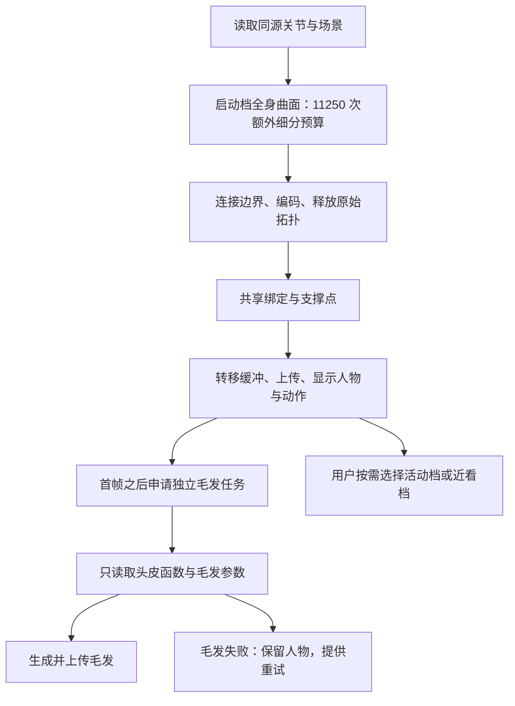

# R15 分阶段启动与诊断

2026-09-12。延续 R14 的显示工作量与全局元素保护，进一步改变首帧前的依赖关系。状态为 Candidate，源码修改不能替代启动和内存实测。

## 为什么继续改启动结构

物理内存约 200 GB 是用户提供的机器信息；浏览器实际堆上限和可用内存尚未观测。Chrome 截图为 `Out of Memory`，它不能单独定位具体分配，也不能说明整台电脑的 RAM 已用尽。

源码显示，原流程在 `detail` 阶段生成毛发，此时全身 canonical 数据、法线场及已完成的原始曲面仍然存活。毛发生成、后续全身连接、绑定都成功后才渲染首帧。移动到 Worker 解决不了计算总量及这些存活期的重叠。

R14 增加总量保护后，R15 的目标是先让完整人物和动作可用，再补充非必需的外观细节；同时把失败阶段留下来，方便下一轮依据实际数据定位。

## 当前启动顺序

- 初始质量为 `preview`，保留原曲面、trim 与精度目标，但额外细分预算是活动档的 1/8，即 11250 次。未满足精度目标时明确显示部分区域采用较粗细节，不伪装成精度验收。
- 初始人体 Worker 不请求毛发。原人体 Worker 完成、被终止、身体就绪并获得绘制机会后，才创建毛发任务。没有第二次全身生成或绑定来换取头发。
- 毛发任务只解码头部所在的 `detail` 参数包，调用相同头皮函数与当前毛发配方；配方与发束优化由独立毛发模块维护。
- 毛发上传先暂存资源，成功再替换。毛发失败不删除 `HumanLab`，不停止已经可用的身体；界面提供局部重试。
- 初始毛发和细节替换在当前页面内串行；同一 origin 的其他标签页使用 Web Locks 共用一把计算锁。等待锁时不创建 Worker、不开始停滞计时，也不分配重建数组。不支持 Web Locks 时仍有当前页面的任务管理，但不能保证跨标签页串行。

## 保留什么诊断

`sessionStorage` 每秒最多保存一次正在运行的进度；阶段切换、完成或失败可立即写入。只保存曲面编号、计数、工作档、错误和时间，不保存模型或大数组。记录按当前标签页区分，并分别保存人体和毛发任务。

重新加载时展示上次未完成的阶段及顶点数量。未完成记录也可能来自用户手动刷新，不能直接称为崩溃证据。若浏览器提供 `performance.memory.jsHeapSizeLimit`，诊断面板显示该值，并明确其不是物理内存总量。该 API 不能完整代表所有 Worker 或页面进程的内存。

## 验证与下一步

当前只做源码装配、语法/作用域、任务顺序、取消清理、参数来源、预算和失败隔离的文件检查。毛发与皮肤任务也在同目录修改文件，交付前需要使用各模块最终一致的接口、来源记录与装配结果完成统一检查。

实际验收需要独立后台浏览器，使用单独用户目录，只打开本机工作台，不接管已有标签页或鼠标。应记录：

1. 首次 `ready` 与首帧是否发生，阶段耗时及几何数量。
2. 毛发是否在身体就绪后独立完成；毛发失败时人物能否继续渲染。
3. 默认档与按需细节切换的内存变化、旧资源是否释放。
4. 两个工作台标签页是否串行计算，而不是同时增加重建峰值。

R15 文件交付时尚未获得运行验证授权。随后用户明确允许独立后台浏览器，运行定位发现并修复了预算未覆盖的退化三角形补点异常；结果与限制见 [R16 启动实测](STARTUP_RUNTIME_R16.md)。现有 `AGENTS.md` 仍要求后续默认仅文件验证，运行需用户另行授权。

如果在有界显示和分阶段生成后仍有性能瓶颈，再评估将高精度拟合放到独立本机进程。它可以使用更大的系统内存，但浏览器仍应只接收有界的显示数据；单纯放大 JavaScript 堆不能修正递归失控或不必要的数据复制。临时显示网格不作为永久来源文件保存。

## 修改前参考

- [MDN：Web Locks API](https://developer.mozilla.org/en-US/docs/Web/API/Web_Locks_API)：协调同源标签页与 Worker 的资源使用。
- [PBRT：Triangle Meshes](https://www.pbr-book.org/4ed/Shapes/Triangle_Meshes)：共享顶点、索引与紧凑表示的内存成本。
- [V8：Pointer Compression](https://chromium.googlesource.com/v8/v8/+/refs/heads/main/docs/heap/pointer-compression.md)：堆地址表示的约束与物理内存容量是不同的问题。
